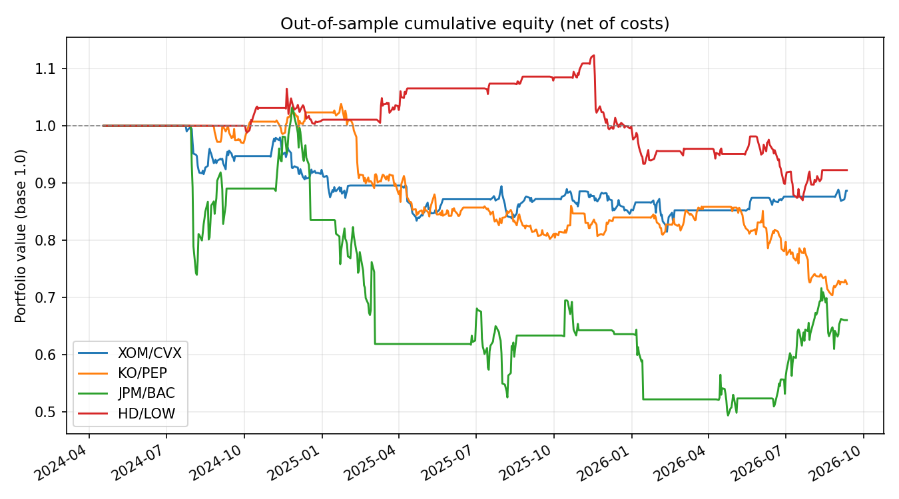

# Pairs Trading - Statistical Arbitrage Backtest

A walk-forward pairs trading backtest on 4 US equity pairs, with a proper
train/test split, transaction costs, and an honest out-of-sample evaluation
(including when the strategy doesn't work).

## Why this project

Built as a technical showcase for quant/stat-arb roles. The goal wasn't to
produce a nice-looking equity curve - it was to build a methodology clean
enough that a negative result is trustworthy and interpretable.

## Method

1. **Universe**: 4 same-sector US equity pairs - XOM/CVX (energy), KO/PEP
   (consumer staples), JPM/BAC (banks), HD/LOW (home improvement retail).
2. **Data**: 8 years of daily closes (Yahoo Finance).
3. **Split**: 70% train / 30% test. All estimation happens on train only.
4. **Cointegration**: Engle-Granger test on train.
5. **Hedge ratio**: OLS regression `price_A ~ price_B` on train, frozen for
   the entire test period.
6. **Signal**: rolling 60-day z-score of the spread, computed only on the
   test window (no leakage). Entry at |z| > 2, exit at |z| < 0.5.
7. **Execution**: position applied with a 1-day lag (no look-ahead).
8. **Costs**: 5 bps per leg, per position change, weighted by (1, β).
9. **Metrics**: annualized Sharpe, max drawdown, annualized turnover.

## Results



| Pair | Cointegration p-value | β | Sharpe | Max DD | Turnover/yr | Total return |
|---|---|---|---|---|---|---|
| XOM/CVX | 0.385 | 0.77 | -0.51 | -18.5% | 7.9 | -11.3% |
| KO/PEP | 0.057 | 0.28 | -1.03 | -32.2% | 7.1 | -27.6% |
| JPM/BAC | 0.989 | 3.26 | -0.34 | -52.2% | 9.2 | -33.9% |
| HD/LOW | 0.119 | 1.18 | -0.31 | -22.5% | 10.9 | -7.7% |

*(significance threshold: p-value < 0.05)*

## Interpretation

None of the four pairs are cointegrated at the 5% level on the training
window (KO/PEP comes closest at 5.7%). Consistent with that, the strategy
loses money out-of-sample on all four pairs, with JPM/BAC - the least
cointegrated pair - showing the worst drawdown (-52%).

This is treated as a valid finding rather than a bug: without a validated
cointegration relationship, there's no structural reason for the spread to
mean-revert, and trading it anyway amounts to betting on noise. The negative
Sharpe ratios are the expected consequence of that, not a modeling error.

## Limitations

- **Small, hand-picked universe.** A real stat-arb desk scans hundreds of
  pairs (or PCA/clustering-based clusters) and keeps only those that pass a
  cointegration filter - here, none do, which is itself the point of
  filtering upstream rather than downstream.
- **Fixed 60-day z-score window** - not tuned, to avoid overfitting to a
  single test period.
- **No stop-loss on the spread** - a pure mean-reversion bet with no
  circuit breaker can run up large drawdowns if the relationship breaks
  structurally (see JPM/BAC, β=3.26, unstable).
- **Equities, not futures** - short-selling financing costs aren't modeled;
  many of the funds this project targets trade more capital-efficient
  instruments (futures, swaps).

## Next iteration

Scan a larger universe (50–100 tickers per GICS sector), keep only pairs
with rolling-window cointegration p-value < 0.05, and add a hard stop-loss
on the z-score (e.g. forced exit if |z| > 4).

## Usage

```bash
pip install -r requirements.txt
python pairs_trading.py
```

Outputs `results_summary.csv` (per-pair metrics) and `results_curves.csv`
(cumulative equity curves), both already included in this repo.

To regenerate the chart above from `results_curves.csv`:

```bash
python plot_results.py
```

## Stack

Python, pandas, statsmodels, yfinance.
